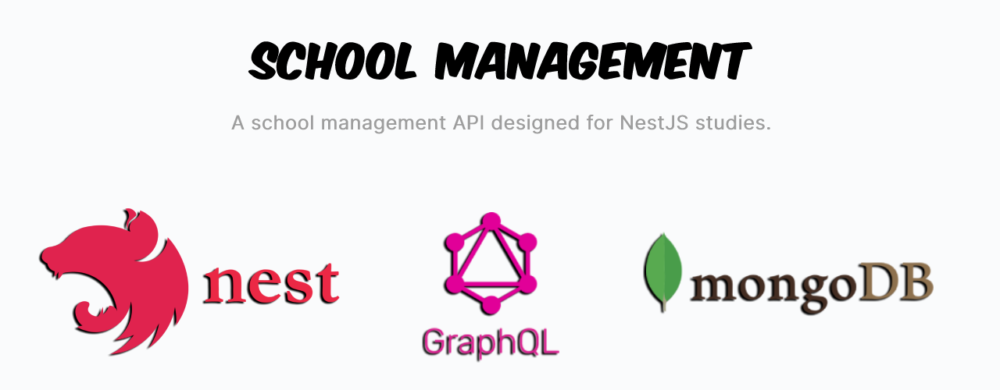

<div align='justify'>



<br>

> A School Management API designed for NestJS studies. Developed using GraphQL, MongoDB and TypeORM.

<br>

## **Techs**

- [Docker](https://www.docker.com/)
- [NestJS](https://nestjs.com/)
- [GraphQL](https://graphql.org/)
- [TypeORM](https://typeorm.io/)
- [MongoDB](https://www.mongodb.com/)
- [Apollo Server](https://www.apollographql.com/docs/apollo-server/getting-started/)

<br>

## **Run**

- Install [Docker](https://docs.docker.com/engine/install/) and [Docker Compose](https://docs.docker.com/compose/install/);
- Run with Docker:

```bash
docker-compose --env-file ./.env.dev up --build -d
```

If you have nodejs installed with version +16.x, you can also run it using the command:

```bash
npm run dev
```

After running, you can access the **Graphql Playground**. [http://localhost:3000/graphql](http://localhost:3000/graphql)

<br>

## **Available Queries**

### Create Lesson

```gql
mutation {
  createLesson(
    createLessonInput: {
      name: "Math Class",
      startDate: "2022-04-02T04:00:00.079Z",
      endDate: "2022-04-02T05:00:00.079Z",
      students: [
        "0878ef35-5cde-49bc-9f7a-b6d75a3509f8",
        "0878ef35-5cde-49bc-9f7a-b6d75a3509f8"
      ]
    }
  ) {
    id
    name
    startDate
    endDate
    students {
      firstName
      lastName
    }
  }
}
```

```json
// Response

{
  "data": {
    "createLesson": {
      "id": "e8af5d90-fa0e-4705-8ddd-4560bea8a3b4",
      "name": "Math Class",
      "startDate": "2022-04-02T04:00:00.079Z",
      "endDate": "2022-04-02T05:00:00.079Z",
      "students": [
        {
          "firstName": "John",
          "lastName": "Doe",
        },
        {
          "firstName": "Mary",
          "lastName": "Jane",
        }
      ]
    }
  }
}
```

### Assign Students To Lesson

```gql
mutation {
  assignStudentsToLesson(
    assignStudentsToLessonInput: {
      lessonId: "e8af5d90-fa0e-4705-8ddd-4560bea8a3b4",
      studentsId: [
        "0878ef35-5cde-49bc-9f7a-b6d75a3509f8",
        "0878ef35-5cde-49bc-9f7a-b6d75a3509f8"
      ]
    }
  ) {
    name
    students {
      firstName
    }
  }
}
```

```json
// Response

{
  "data": {
    "assignStudentsToLesson": {
      "name": "Math Class",
      "students": [
        {
          "firstName": "John"
        },
        {
          "firstName": "Mary"
        },
      ]
    }
  }
}
```

### Get Lessons

```gql
query {
  lessons {
    name
  }
}
```

```json
// Response

{
  "data": {
    "lessons": [
      {
        "name": "Math Class"
      },
      {
        "name": "NestJS Class"
      },
    ]
  }
}
```

### Get Lesson

```gql
query {
  lesson(id: "e8af5d90-fa0e-4705-8ddd-4560bea8a3b4") {
    name
    startDate
  }
}
```

```json
// Response

{
  "data": {
    "lesson": {
      "name": "Math Class",
      "startDate": "2022-04-02T04:00:00.079Z"
    }
  }
}
```

### Create Student

```gql
mutation {
  createStudent(
    createStudentInput: {
      firstName: "John",
      lastName: "Doe"
    }
  ) {
    id
    firstName
    lastName
  }
}
```

```json
// Response

{
  "data": {
    "createStudent": {
      "id": "0878ef35-5cde-49bc-9f7a-b6d75a3509f8",
      "firstName": "John",
      "lastName": "Doe"
    }
  }
}
```

### Get Students

```gql
query {
  students {
    firstName
  }
}
```

```json
// Response

{
  "data": {
    "students": [
      {
        "firstName": "John"
      },
      {
        "firstName": "Mary"
      }
    ]
  }
}
```

### Get Student

```gql
query {
  student(id: "0878ef35-5cde-49bc-9f7a-b6d75a3509f8") {
    firstName
    lastName
  }
}
```

```json
// Response

{
  "data": {
    "student": {
      "firstName": "John",
      "lastName": "Doe"
    }
  }
}
```

<br>

## **References**

- [NestJS - Zero to Hero](https://www.udemy.com/course/nestjs-zero-to-hero/?utm_source=adwords&utm_medium=udemyads&utm_campaign=WebDevelopment_v.PROF_la.EN_cc.BR_ti.8322&utm_content=deal4584&utm_term=_._ag_108455848694_._ad_467154447027_._kw__._de_c_._dm__._pl__._ti_dsa-774930035449_._li_9100507_._pd__._&matchtype=&gclid=EAIaIQobChMIyOqbvu_79gIVwgqRCh1SrgtnEAAYASAAEgLfwfD_BwE)

</div>
